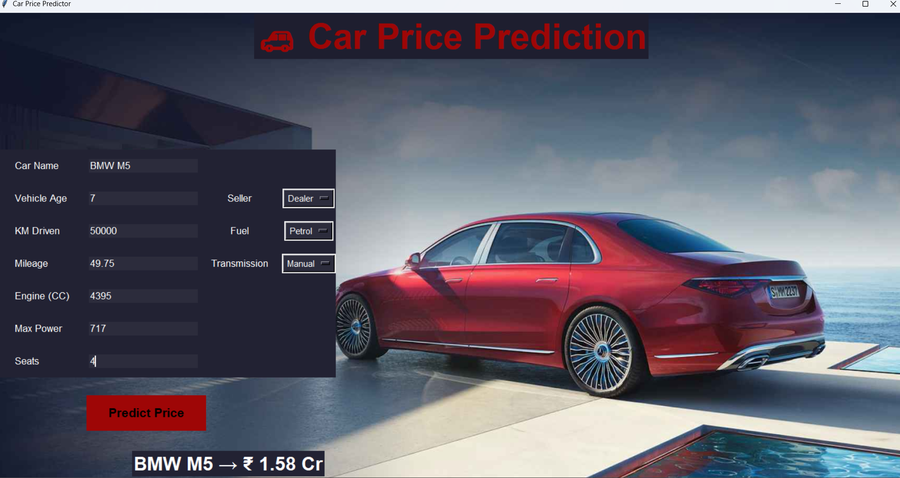

# 🚗 Car Price Prediction Using Machine Learning

## 📌 Project Overview

Car Price Prediction is an end-to-end Machine Learning project designed to estimate the selling price of used cars based on various vehicle attributes. The application utilizes historical car data and a trained Random Forest Regression model to generate accurate price predictions.

The project covers the complete machine learning lifecycle, including data preprocessing, exploratory data analysis (EDA), feature engineering, model training, evaluation, and deployment through an interactive GUI developed using Python Tkinter. Users can enter vehicle details such as age, kilometers driven, mileage, engine capacity, fuel type, transmission type, and seller type to receive real-time price estimates.

## 🎯 Objectives

* Predict used car prices accurately using machine learning techniques.
* Analyze the impact of vehicle features on selling price.
* Build a complete end-to-end machine learning pipeline.
* Provide a user-friendly interface for real-time predictions.
* Demonstrate practical applications of machine learning in the automobile industry.

## ✨ Key Features

* End-to-End Machine Learning Pipeline
* Random Forest Regression Model
* Data Cleaning and Preprocessing
* Exploratory Data Analysis (EDA)
* Feature Engineering and Scaling
* Model Persistence using Pickle
* Interactive GUI with Tkinter
* Real-Time Price Prediction
* Scalable and Organized Project Structure

## 🛠️ Technologies Used

### Programming Language

* Python

### Libraries

* Pandas
* NumPy
* Matplotlib
* Seaborn
* Plotly
* Scikit-learn
* Tkinter
* Pillow (PIL)
* Pickle

### Development Tools

* Jupyter Notebook
* Visual Studio Code (VS Code)

## 🤖 Machine Learning Model

The project uses the **Random Forest Regressor** algorithm for predicting used car prices.

### Model Development Process

* Data Cleaning and Preprocessing
* Feature Selection
* Train-Test Split
* Feature Scaling
* Model Training
* Model Evaluation
* Model Saving using Pickle

### Evaluation Metrics

* Mean Absolute Error (MAE)
* Mean Squared Error (MSE)
* R² Score

## 🔄 Project Workflow

1. Data Collection
2. Data Cleaning and Preprocessing
3. Exploratory Data Analysis (EDA)
4. Feature Engineering
5. Feature Scaling
6. Model Training
7. Model Evaluation
8. Model Persistence
9. GUI Development
10. Real-Time Price Prediction

## 📁 Project Structure

```text
Car-Price-Prediction/
│
├── App/
├── data/
├── saved_models/
├── saved_scaling/
│
├── .gitignore
├── README.md
├── car-price-prediction.png
├── main.ipynb
└── requirements.txt
```

📷 Project Preview


## 🚀 Applications

* Used Car Dealerships
* Vehicle Valuation Systems
* Automobile Marketplaces
* Car Resale Platforms
* Data-Driven Pricing Solutions

## 📈 Future Enhancements

* Web Application Deployment using Flask or Streamlit
* Cloud Deployment
* Advanced Feature Engineering
* Hyperparameter Tuning
* Real-Time Market Data Integration
* Enhanced Dashboard and User Experience

## ✅ Conclusion

This project demonstrates the practical application of Machine Learning, Data Analysis, and Python GUI Development for solving real-world vehicle pricing challenges. By combining data preprocessing, feature engineering, Random Forest Regression, and an interactive Tkinter-based interface, the application delivers accurate and real-time car price predictions.

The project serves as a strong portfolio project showcasing skills in machine learning, data analytics, model deployment, and software development.

⭐ If you found this project useful, consider giving it a star on GitHub.
